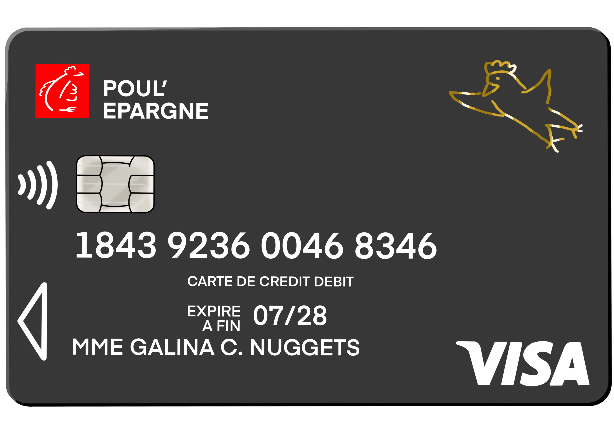
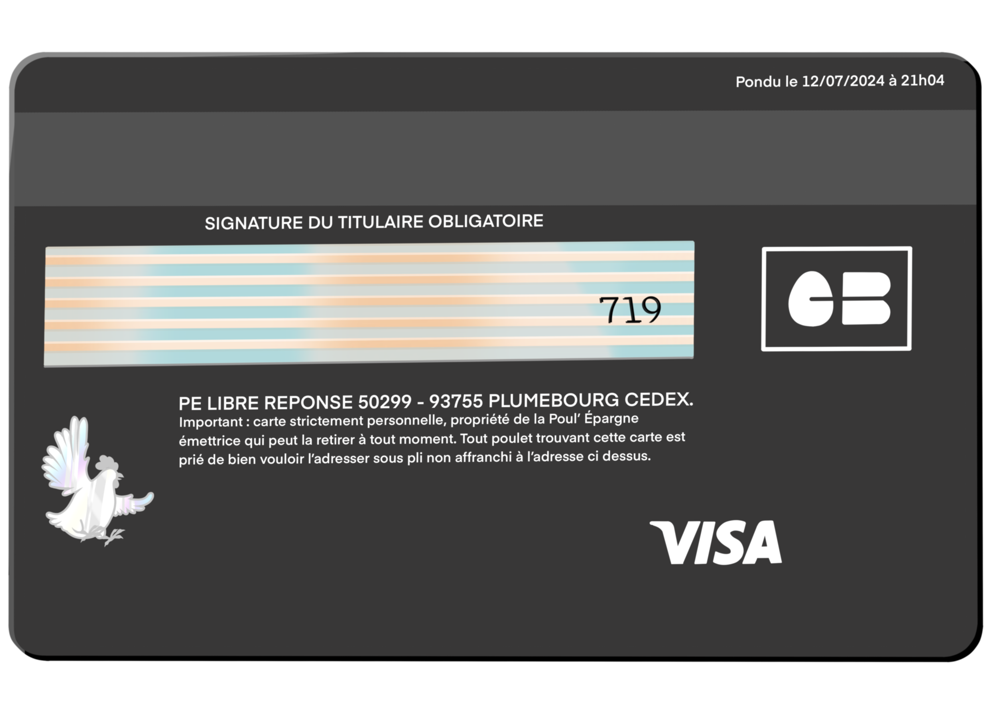

# 🐔 Défi React : Créez la carte de crédit Poul’Epargne ! 🐔

Bienvenue, chers développeurs et développeuses !

Aujourd'hui, nous vous proposons un défi amusant et créatif qui vous plongera dans l'univers fantastique de **Poul’Epargne**, la banque préférée des poulets. Enfilez vos plumes et préparez-vous à coder une carte de crédit unique en son genre.

## 📜 Contexte du Défi

Vous êtes recruté(e) en tant que développeur(euse) frontend par la prestigieuse banque **Poul’Epargne**. Cette banque, destinée exclusivement à une clientèle avicole exigeante, souhaite lancer une nouvelle carte de crédit. Votre mission, si vous l'acceptez, est de créer une interface utilisateur pour cette carte de crédit.

## 🎨 Design de la Carte de Crédit

Voici l'image de la carte de crédit que vous devez reproduire :

## 🔍 Critères d'Évaluation

Votre travail sera évalué selon les critères suivants :
- **Qualité du code** : Code propre, bien structuré et commenté.
- **Responsivité** : La carte doit être correctement affichée sur différents types d'écrans (mobile, tablette, desktop).
- **Fidélité au design** : La carte doit être une reproduction fidèle de l'image fournie.

---

Nous avons hâte de voir vos créations et de célébrer ensemble la grandeur de la banque Poul’Epargne. Que le meilleur poulet gagne !

Bon code à tous et à toutes ! 🐔💳

## 🔓 Bonus Secrets pour les Développeurs Intrépides

### 🥚 Bonus 1 : Protection des Informations Sensibles

Les poulets de PoulEpargne sont très soucieux de leur sécurité. Ajoutez une fonctionnalité pour masquer les 12 premiers numéros de la carte de crédit. Affichez-les sous forme d'astérisques (`**** **** **** 1234`). Cette fonctionnalité permettra aux poulets de garder leurs informations confidentielles !

### 🐣 Bonus 2 : Carte à Deux Faces

Pour une expérience encore plus interactive, reliez les deux faces de la carte de crédit et permettez à l'utilisateur de retourner la carte au clic. Vos compétences en React vont vraiment briller avec cette fonctionnalité !
